<h1 style="text-align: center"> 
    question-answering-web-app
</h1>

<h2 style="text-align: center">
    Expertise
</h2>

### Introduction
This is a web-based system for a question answering service, similar to Stack
Overflow, Yahoo Answers, Baidu zhidao, or even piazza. This is a final project for the Principles of Databases Systems course.

### Features

#### (1) Signup and Login
Users can sign up and then log in with their emails and passwords.

 
 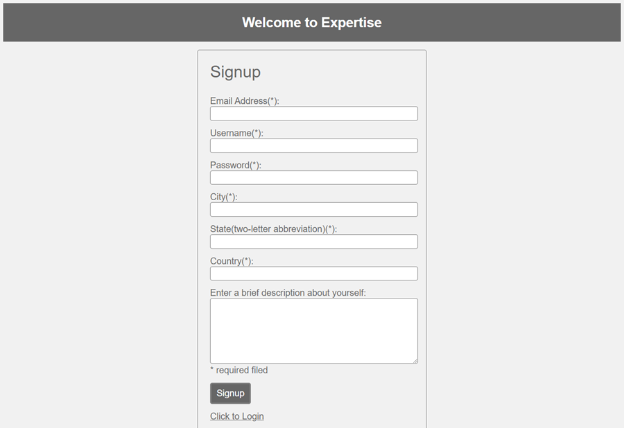
 

Once logged in, the user will see his/her home page, which shows the user’s current status, recent questions and answers. If the user moves the mouse over the button with his/her username on it at the upper right corner, a dropdown menu for profile editing and logout will be shown. The navigation bar allows the user to browse topic, see his/her own questions and answers, post new questions, and search for questions.

 
 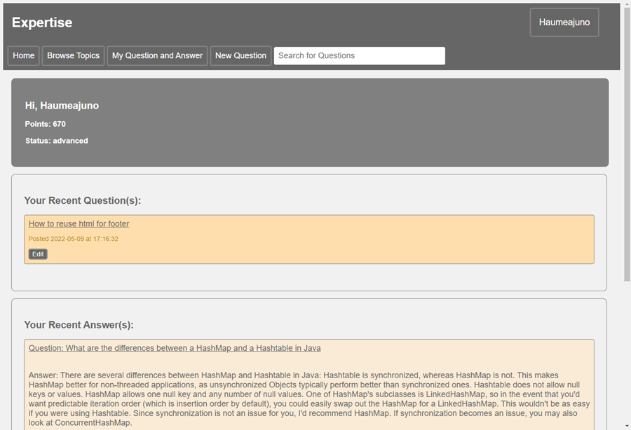

#### (2) Edit Profile Information
In the upper right corner, there’s a button with username on it; a dropdown menu will be shown on hover. If the user clicks “My Account”, he/she will be directed to the page with his/her personal information.

 
 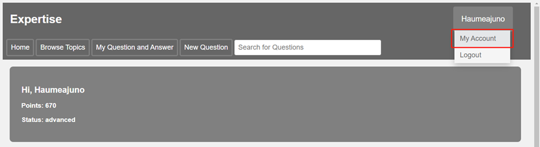
 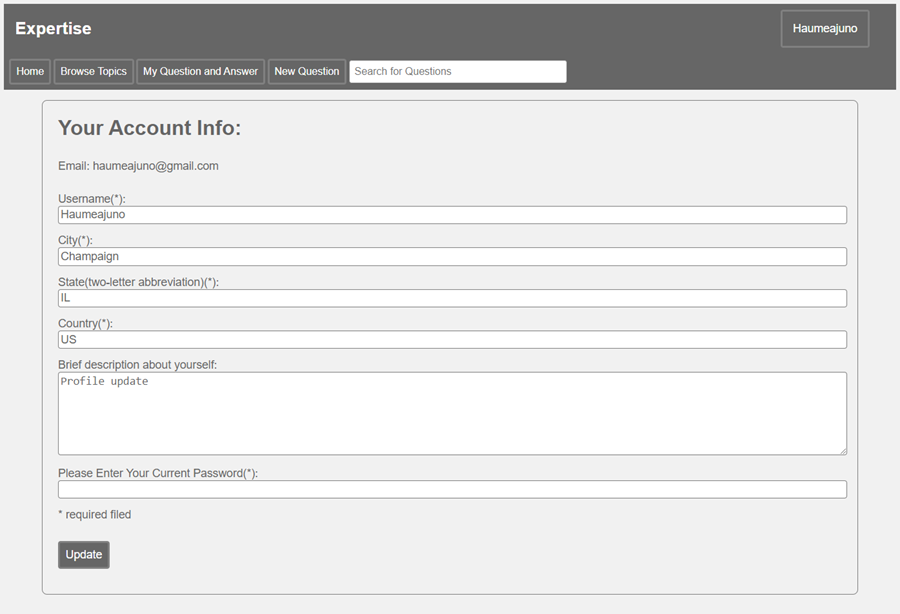

The text boxes are prefilled with the user’s current information which is based on the query result from the backend database. The user does not need to reenter the information he/she does not want to change.
For security purpose, the user needs to enter the password to update his/her personal information.

#### (3) Browse Topics
If the user moves the mouse over “Browse Topics” button, a dropdown menu of available top-level topics will be shown. The menu items are generated from a query result. If we ever make any more top-level topics available in the backend database, the menu will be updated automatically.

 
 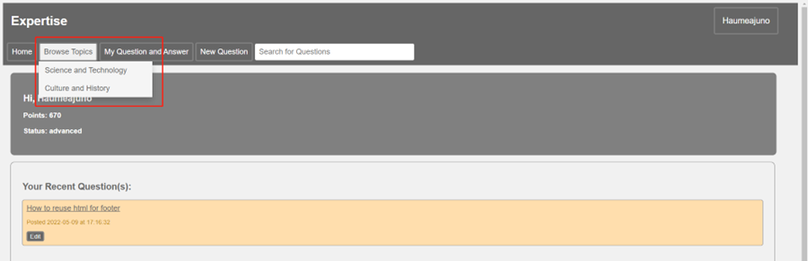

If the user clicks on one of the categories, the user will be directed to a page showing the next-level topics under that category. 

 
 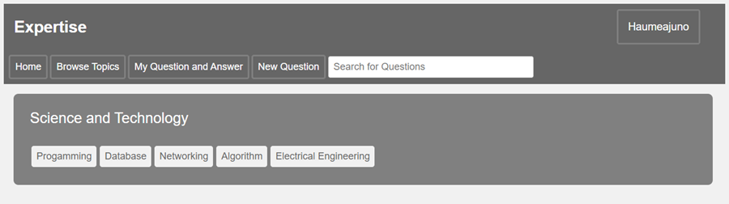

A number of buttons, each for a topic is listed. If the user clicks on any of the button, the user will be directed to a page showing a list of questions belonging to that specific topic. 

 
 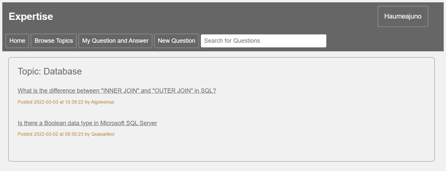

#### (4) Search Questions (Sort by Relevance)
There’s a search box on the navigation bar, and a text “Search for Questions” is shown to guide the user for question searching. A user can enter any keyword and press “enter”; then a list of relevant questions will be shown. 

 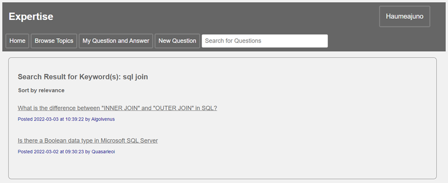

#### (5) Read Question Details and Answers
A user can get a list of question links by topic browsing, keyword searching etc. The user can then click on any of the question links that interest him/her. The click will direct the user to the page showing the details of the question and posted answers. 

 
 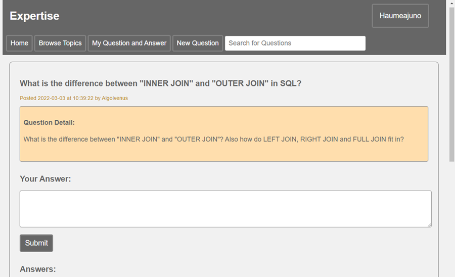
 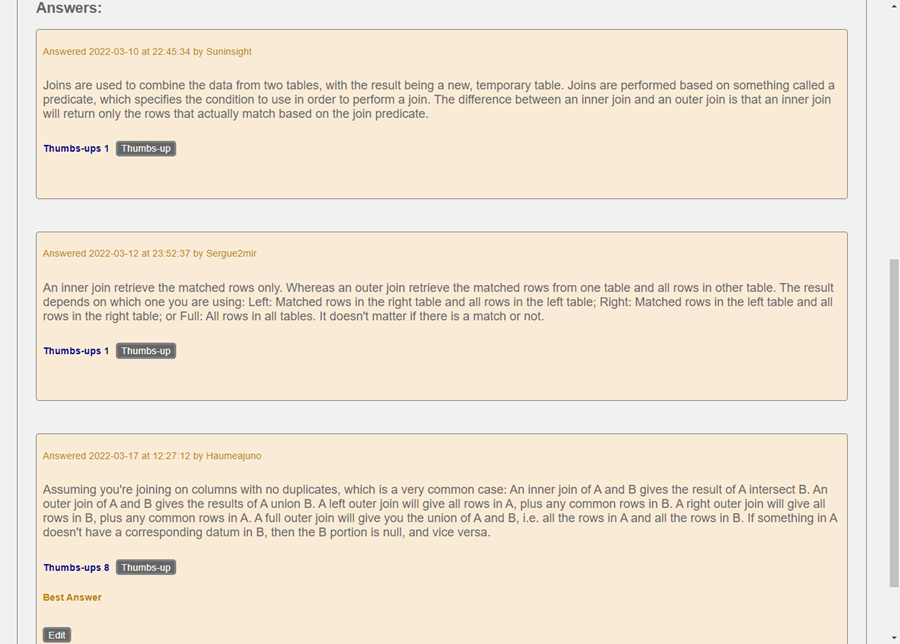

#### (6) Post an Answer
The user can enter an answer and click “Submit”. If the submission is successful, the user will get a message stating so.

 
 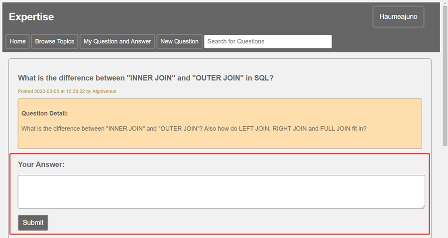

#### (7) Update an Answer Posted by the User
For each answer shown on the question detail page, an “Edit” button will be shown if the answer was posted by the current user. The user can also edit an answer from “My Answer” page

 
 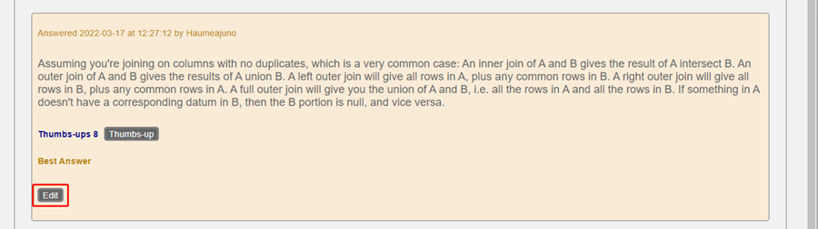

If the user clicks the “Edit” button, he or she will be directed to a page for answer editing. The question is still visible so the user can review the question while editing the answer. The text box is prefilled with the current answer body; the user can then edit the answer as he/she sees fit, and click “Submit” to update the answer. If the update is successful, the user will get a message stating so. 

 
 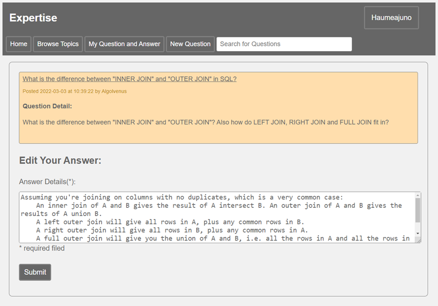

#### (8) Give a Thumbs-up to an Answer
Under each answer, there’s a “Thumbs-up” button; a user can click on the button to give the answer a thumbs-up. If the user gave a thump-up to an answer previously, a message will be shown to remind the user. If the user changed his/her mind and decides to cancel the thumbs-up, he/she can click on the thumbs-up button one more time;  the thump-up will then be cancelled.

 
 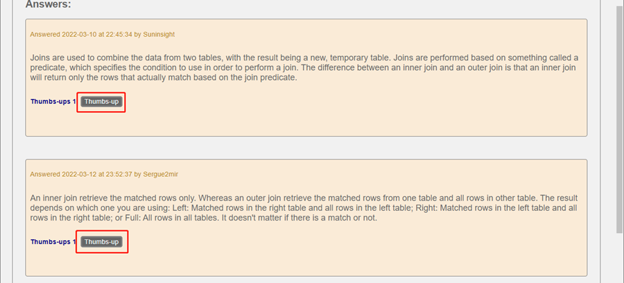

#### (9) Select a Best Answer
If the question is posted by the current user, on the question detail page, there will be a “Select as Best Answer” button under each answer which has not been selected as the best answer. A “Best Answer” sign is shown under the best answer selected by the user. The user can change the selection of the best answer by click on any “Select as Best Answer” buttons under other answers. 

 
 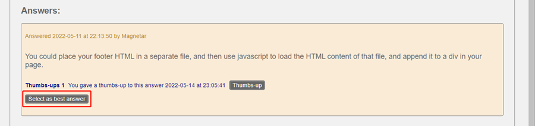
 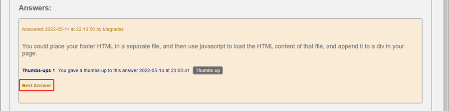

#### (10) Post a Question
If a users wants to post a new question, he/she can click on “New Question” button on the navigation bar, which will directed the user to question posting page. The user is required to select a topic from the dropdown list. The dropdown list is generated by the result of a query against the backend database. The dropdown list shows each category and each topic under the category. The user can then enter question title and body, and click “Post” to submit the question. If the submission is successful, the user will get a message stating so.

 
 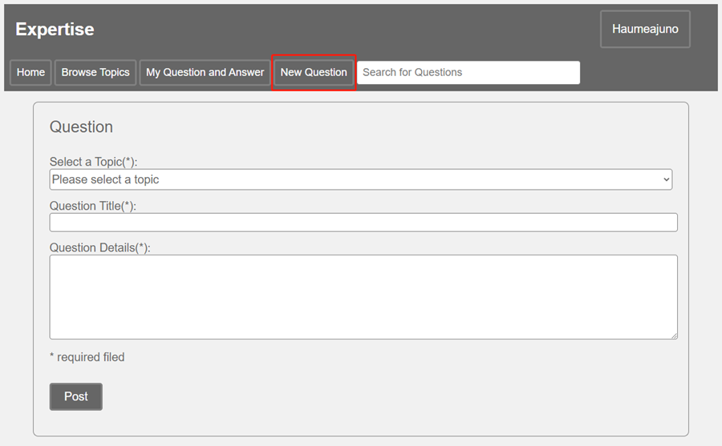
 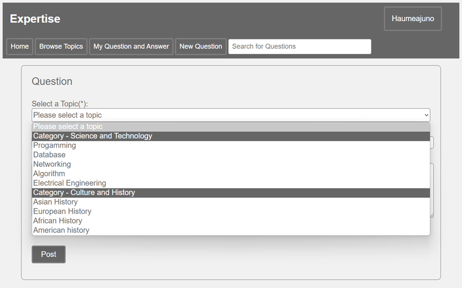

#### (11) Review Posted Questions and Answers by the User
A user can see all of his/her posted questions or answer by going to the “My Question and Answer” menu and click on “My Question” or “My Answer”. 

 
 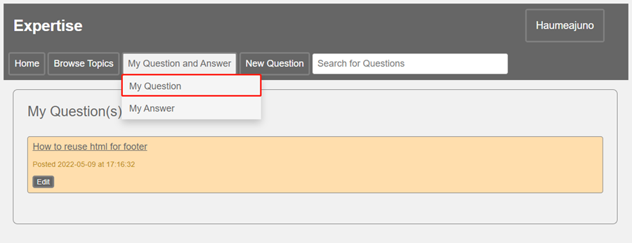
 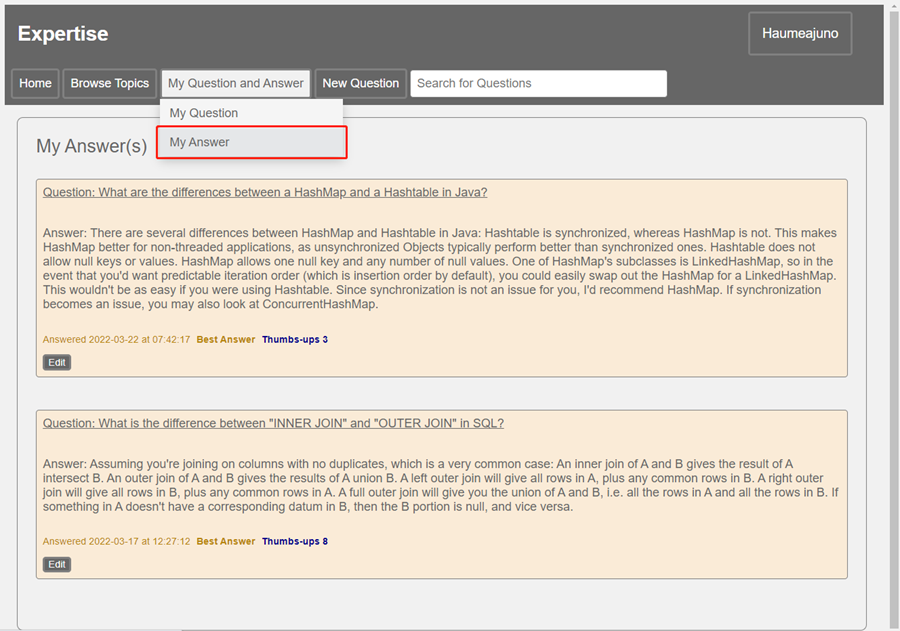

#### (12) Edit a Question Posted by the User
A user can edit his/her posted question by clicking on the “Edit” button shown on the My Question page or the question detail page.

 
 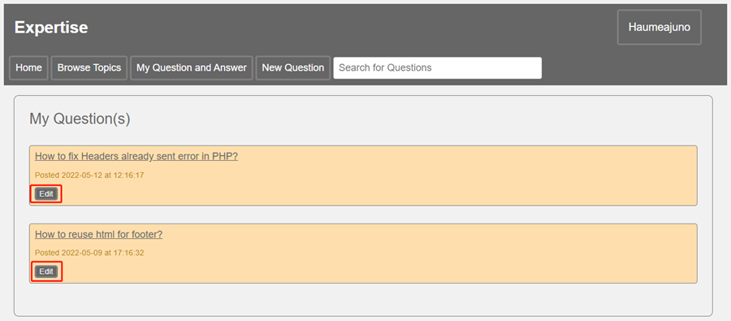
 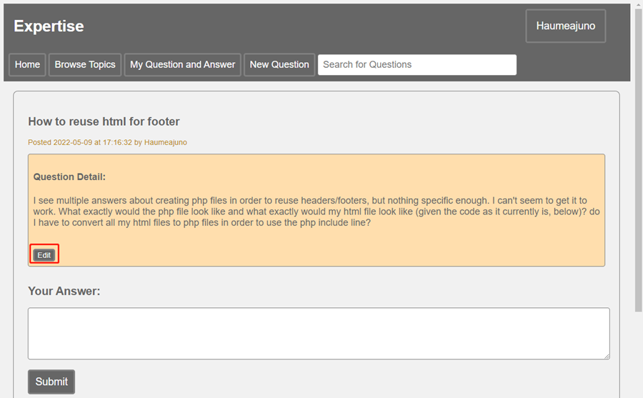

Once clicking the edit button, the user will be directed to the question editing page. The text boxes are prefilled with the current question title and body; the user can then edit the question title or body as he/she sees fit, and click “Submit” to update the question. If the update is successful, the user will get a message stating so.

 
 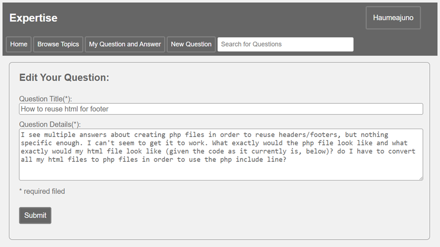

#### (13) Mark a Question as Resolved
A user can mark his/her question as “Resolved” by clicking on the “Resolved” button shown on the question detail page. If a user wants to change his/her question from “Resolved” back to “Unresolved”, he/she can click on the “Unresolved” button which is shown if the question was previously marked as “Resolved”.

 
 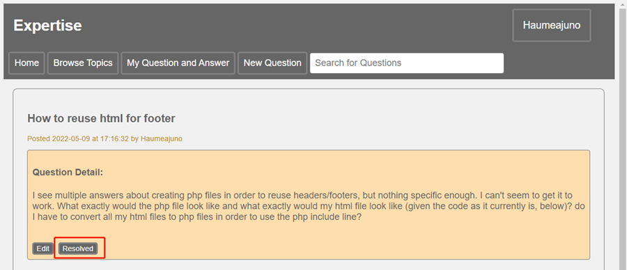
 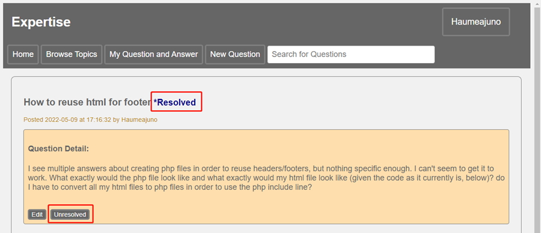

#### (14) Periodic Update of User Points and Status
A SQL procedure named “updateUserStatus” has been defined. The system administrator can call this procedure periodically (say once a day) to recompute and update user status.

#### (15) Prevent SQL Injection
Prepared statements are used for all SQL queries throughout this project to prevent SQL injection.

